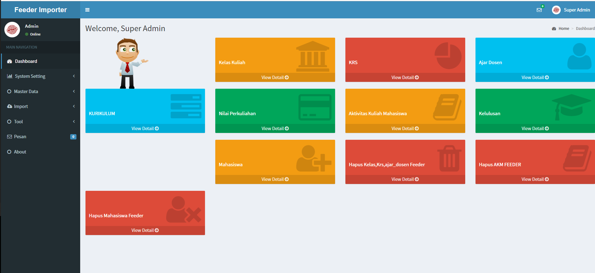

* Feeder Importer Adalah Aplikasi Untuk Membantu Operator Kampus Untuk Mempercepat Pelaporan ke Feeder Dikti
* Anda Bisa Import data Excel sesuai dengan template yang disediakan sehingga proses lebih cepat. 



## Installation
* Install Xampp Server https://www.apachefriends.org/index.html
* Buat Folder Baru di C:/xampp/htdocs/feeder-importer
* Copy Semua File Ke directory baru tersebut
* Buka phpmyadmin http://localhost/phpmyadmin, lalu buat database baru misal : feeder_importer
* import db.sql ke databse baru tersebut
* Buka file config.php di C:/xampp/htdocs/feeder-importer/admina/inc/config.php
edit lalu sesuaikan username,pass, dan nama database,
```php
	define( "DATABASE_NAME", "feeder_importer" );
	define( "DB_USERNAME", "root" );

	define( "PORT", 3306);
	//password mysql
	define( "DB_PASSWORD", "" );
	//dir admin
	define( "DIR_ADMIN", "feeder-importer/admina/");
	//main directory
	define( "DIR_MAIN", "feeder-importer/");
```
* buka Aplikasi di http://localhost/feeder-importer
```
	username : admin
	password : admin
```
Sekian Semoga Bermanfaat

Tanya lebih lanjut wildannudin@gmail.com